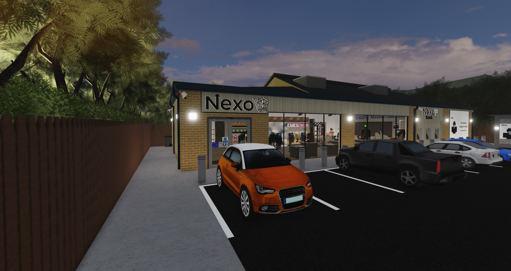
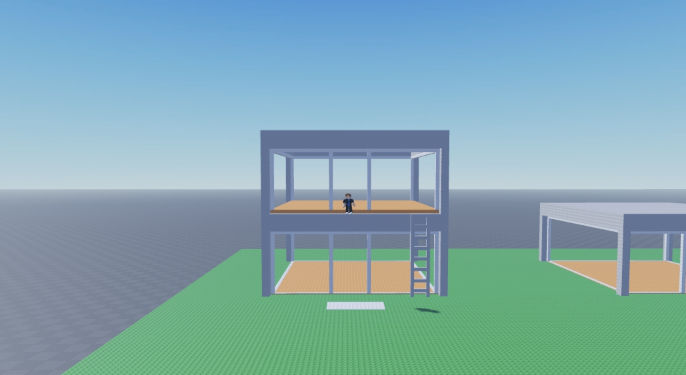

<!DOCTYPE html>
<html lang="en">

<head>

    <meta charset="UTF-8">

    <meta
        name="viewport"
        content="width=device-width, initial-scale=1.0"
    >

    <title>Staryjump | Portfolio</title>

    

</head>

<body>

    <!-- =========================
         BACKGROUND
    ========================= -->

    

        

        

        

    

    <!-- =========================
         NAVIGATION
    ========================= -->

    <nav id="navbar">

        

            Staryjump
        

        

            <a href="#about">
                About
            </a>

            <a href="#skills">
                Skills
            </a>

            <a href="#experience">
                Experience
            </a>

            <a href="#projects">
                Projects
            </a>

            <a href="#contact">
                Contact
            </a>

        

    </nav>

    <!-- =========================
         HOME
    ========================= -->

    <section class="hero">

        

            

                Hey, I'm
            

            <h1>
                Staryjump
            </h1>

            <h2>
                Welcome to my portfolio
            </h2>

            

                I enjoy creating things, working on projects and
                learning new skills. This is where I keep some of
                the things I've worked on.
            

            

                <a
                    class="button primary"
                    href="#projects"
                >
                    See my work
                </a>

                <a
                    class="button"
                    href="#contact"
                >
                    Find me online
                </a>

            

        

        

            ↓ Scroll
        

    </section>

    <!-- =========================
         ABOUT
    ========================= -->

    <section id="about" class="animate">

        <h2 class="section-title">
            About Me
        </h2>

        

            

            

                

                    Hey! I'm Staryjump. I like working on projects
                    and creating things on Roblox. I also enjoy
                    learning more about programming and web
                    development.
                

                 

                

                    Outside of projects, I like playing games,
                    working on ideas and improving the things
                    I create.
                

                

                    

                        🎮 Roblox
                    

                    

                        💻 Luau
                    

                    

                        🧱 Building
                    

                    

                        🌐 HTML
                    

                

            

        

    </section>

    <!-- =========================
         SKILLS
    ========================= -->

    <section id="skills" class="animate">

        <h2 class="section-title">
            My Skills
        </h2>

        

            <!-- LUAU -->

            

                

                    

                        💻
                    

                    <h3>
                        Luau
                    </h3>

                

                

                    Roblox scripting.
                

            

            <!-- BUILDING -->

            

                

                    

                        🧱
                    

                    <h3>
                        Building
                    </h3>

                

                

                    Maps and environments.
                

            

            <!-- HTML / CSS -->

            

                

                    

                        🌐
                    

                    <h3>
                        HTML / CSS
                    </h3>

                

                

                    Web design.
                

            

            <!-- JAVASCRIPT -->

            

                

                    

                        ⚡
                    

                    <h3>
                        JavaScript
                    </h3>

                

                

                    Web development.
                

            

        

    </section>

    <!-- =========================
         WORK HISTORY
    ========================= -->

    <section id="experience" class="animate">

        <h2 class="section-title">
            Work History
        </h2>

        

            <!-- =========================
                 FRESHLY
            ========================= -->

            

                

                    

                

                

                    <h3 class="work-company">
                        Freshly
                    </h3>

                    

                        Store Management
                    

                    

                        2026
                    

                    

                        Experience in store management within
                        the Roblox environment.
                    

                

            

            <!-- =========================
                 NEXO CORPORATION
            ========================= -->

            

                

                    

                

                

                    <h3 class="work-company">
                        Nexo Corporation
                    </h3>

                    

                        Corporate Intern
                    

                    

                        2026
                    

                    

                        Experience as a Corporate Intern within
                        a Roblox corporate environment.
                    

                

            

                  <!-- =========================
     EXPERIENCE 3
========================= -->

    

        

    

    

        <h3 class="work-company">
            Company Name
        </h3>

        

            Your Role
        

        

            2026
        

        

            Write your experience description here.
        

    

<!-- =========================
     EXPERIENCE 4
========================= -->

    

        

    

    

        <h3 class="work-company">
            Company Name
        </h3>

        

            Your Role
        

        

            2026
        

        

            Write your experience description here.
        

    

<!-- =========================
     EXPERIENCE 5
========================= -->

    

        

    

    

        <h3 class="work-company">
            Company Name
        </h3>

        

            Your Role
        

        

            2026
        

        

            Write your experience description here.
        

    

 
  

            <!-- =========================
                 ADD MORE EXPERIENCES HERE
                 
                 Copy a complete .work-card
                 and change:

                 1. image
                 2. company name
                 3. role
                 4. date
                 5. description

                 ========================= -->

        

    </section>

    <!-- =========================
         PROJECTS
    ========================= -->

    <section id="projects" class="animate">

        <h2 class="section-title">
            My Projects
        </h2>

        

            

                

            

            

                <h3>
                    Dropper Game
                </h3>

                

                   A Roblox Dropper project created to test gameplay ideas, map design and different mechanics.
                

                
                    Test Project
                

            

        

    </section>

    <!-- =========================
         CONTACT
    ========================= -->

    <section id="contact" class="animate">

        

            <h2 class="section-title">
                Find me online
            </h2>

            

                You can find me on the platforms below.
            

            

                <!-- DISCORD -->

                <a
                    class="social"
                    href="https://discord.com/users/1088893328994619504"
                    target="_blank"
                    rel="noopener noreferrer"
                >

                    <svg
                        viewBox="0 0 24 24"
                        aria-hidden="true"
                    >

                        <path d="M19.54 5.32A16.9 16.9 0 0 0 15.8 4.15l-.47.96a15.1 15.1 0 0 0-6.66 0l-.47-.96a16.9 16.9 0 0 0-3.74 1.17C2.1 8.84 1.46 12.25 1.78 15.62a16.9 16.9 0 0 0 5.15 2.6l1.25-1.68c-.69-.26-1.35-.59-1.97-.98l.48-.37c3.8 1.77 7.92 1.77 11.67 0l.48.37c-.62.39-1.28.72-1.97.98l1.25 1.68a16.9 16.9 0 0 0 5.15-2.6c.38-3.91-.65-7.28-3.73-10.3ZM8.68 14.08c-1.14 0-2.08-1.04-2.08-2.32s.92-2.32 2.08-2.32 2.1 1.04 2.08 2.32c0 1.28-.92 2.32-2.08 2.32Zm6.64 0c-1.14 0-2.08-1.04-2.08-2.32s.92-2.32 2.08-2.32 2.1 1.04 2.08 2.32c0 1.28-.92 2.32-2.08 2.32Z"/>

                    </svg>

                    Discord

                </a>

                <!-- GITHUB -->

                <a
                    class="social"
                    href="TON_GITHUB_LINK"
                    target="_blank"
                    rel="noopener noreferrer"
                >

                    <svg
                        viewBox="0 0 24 24"
                        aria-hidden="true"
                    >

                        <path d="M12 .5a12 12 0 0 0-3.79 23.39c.6.11.82-.26.82-.58v-2.03c-3.34.73-4.04-1.42-4.04-1.42-.55-1.39-1.34-1.76-1.34-1.76-1.09-.75.08-.74.08-.74 1.2.09 1.83 1.23 1.83 1.23 1.07 1.83 2.8 1.3 3.48.99.11-.77.42-1.3.76-1.6-2.67-.3-5.47-1.34-5.47-5.95 0-1.31.47-2.38 1.23-3.22-.12-.3-.53-1.52.12-3.17 0 0 1-.32 3.3 1.23a11.5 11.5 0 0 1 6 0c2.3-1.55 3.3-1.23 3.3-1.23.65 1.65.24 2.87.12 3.17.76.84 1.23 1.91 1.23 3.22 0 4.62-2.81 5.64-5.49 5.94.43.37.81 1.1.81 2.22v3.29c0 .32.22.69.83.57A12 12 0 0 0 12 .5Z"/>

                    </svg>

                    GitHub

                </a>

                <!-- ROBLOX -->

                <a
                    class="social"
                    href="https://www.roblox.com/share?code=dda92c69ae24364fa71dc8949b1fbd41&type=Profile&source=ProfileShare&stamp=1787535416100"
                    target="_blank"
                    rel="noopener noreferrer"
                >

                    <svg
                        viewBox="0 0 24 24"
                        aria-hidden="true"
                    >

                        <path d="m5.4 3.2 15.4 4.1-4.2 15.4-15.4-4.2L5.4 3.2Zm3.7 7.2-1.1 4 4 1.1 1.1-4-4-1.1Z"/>

                    </svg>

                    Roblox

                </a>

            

        

    </section>

    <!-- =========================
         FOOTER
    ========================= -->

    <footer>

        

            © 2026 Staryjump
        

    </footer>

    <!-- =========================
         JAVASCRIPT
    ========================= -->

    

</body>

</html>
